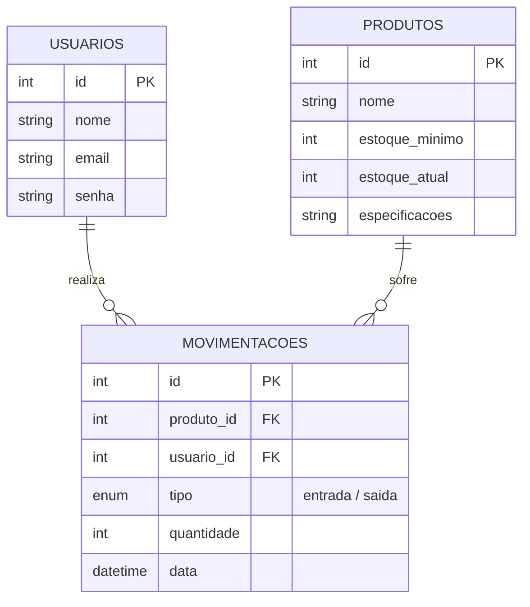

# ENTREGA 02 – Diagrama Entidade Relacionamento (DER)

O diagrama abaixo representa a estrutura do banco de dados `saep_db`, garantindo a rastreabilidade e integridade das informações.

### Descrição das Tabelas:

1.  **USUARIOS**: Armazena os dados dos funcionários do almoxarifado que operam o sistema.
2.  **PRODUTOS**: Contém o catálogo de equipamentos (Smartphones, Notebooks, TVs) com seus respectivos níveis de estoque e especificações técnicas.
3.  **MOVIMENTACOES**: Tabela de junção que registra cada entrada e saída, vinculando o produto ao usuário responsável, com data e hora.
